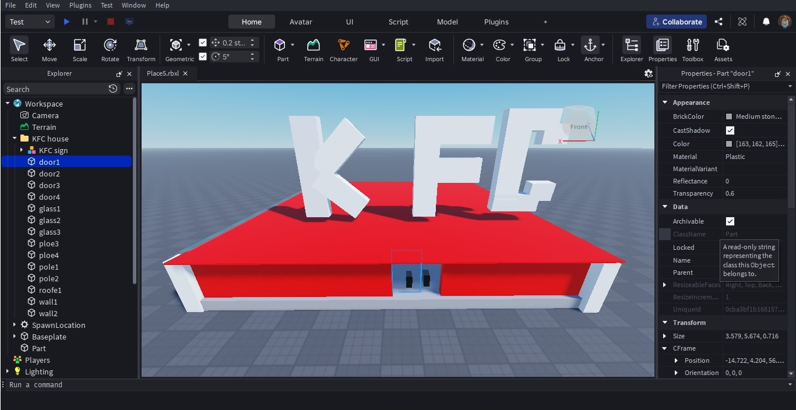
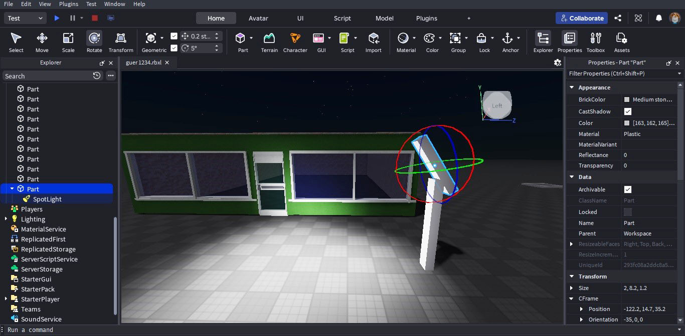

# SECTION 1 — Engineering Competency Dashboard

### [M2603]

## 2026 March Highlight: Mastering Spatial Proportions & Transitioning to Audited Control Loops

This month documented Guer’s exceptional entry into 3D environmental architecture, spatial geometry calibration, and computational logic translation. At 10 years old (Grade 4), Guer displayed strong visual-spatial intelligence, transitioning rapidly from manual viewport camera navigation to structural scene composition and managing parent-child object hierarchies within the game engine workspace.

Guer’s technical development focused on establishing "Cognitive Discipline" to balance his natural creative velocity. As a proactive learner who quickly visualizes mechanics ahead of instruction, he successfully learned to stabilize his execution pipeline—shifting from rapid trial-and-error prototyping to systematic line-by-line code tracing under nested logical load. By integrating structural design boundaries with event-driven parameters, his focus expanded from static world-building toward mastering how object states, automated loop cycles, and conditional validation arrays are cleanly refactored and stabilized.

### 🎯 Core Competencies Demonstrated This Month

* **🏆 Concrete Engineering Outputs:** Proportional Scene Architecture, Asset Scaling & Automated Bidirectional Elevator Sub-systems
* **🧠 Research & Methodology Inputs:** Physical Parameter Auditing, Scope Validation ("The End Hunt") & Post-Lesson Logical Transfer Tasks
* **🤝 Mentor Review Dynamics:** Transitioning from Rote Template Replication to Real-time Workflow Adjustment

---

### 📊 Evidence Snapshot

* 📷 Curated Engineering Artifacts Displayed: 6
* ⚙️ Production Sandbox Implementations: 2
* 🐞 Runtime Debugging & Prompt Audits: 1

---

### 🗣️ Student's Engineering Reflections

> *"ดูตัวเลข Properties มากขึ้น สนุกใช้ Toolbox ร้านสวยดี ตัวอย่างไม่บอกตัวเลขเลยยาก  -Guer 13 March 2026"*

> *"ตอนแรกเบื่อ ต้องคิดเยอะ โดนบังคับให้ค่อยๆดู เริ่มเข้าใจรวมตัวแปร ตอนนี้ทำได้แล้ว IF ELSE พอเข้าใจแล้ว  -Guer 23 March 2026"*

---

💡 *Note: The technical artifacts and code snapshots demonstrated above represent a curated selection of Guer's total engineering workflow and documentation for this month. Complete underlying records, including expanded script versions and full research sessions, are systematically archived and fully available upon request.*

# SECTION 2 — March 2026 Engineering Logs

---

## 🏛️ Part A: Spatial Architecture & Visual Parameter Auditing
#### (Core Concepts: Structural Geometry, Asset Calibration & Environmental Layouts)

### 📌 1A: 3D Spatial Layout & Proportional Environment Design
<table> <tr> <td width="50%" align="center" style="background-color: #f8fafc; color: #1e293b;"><b>Left (L): Data Hierarchy & Folder Tree Structuring</b></td> <td width="50%" align="center" style="background-color: #f8fafc; color: #1e293b;"><b>Right (R): Proportional Asset Scaling & Illumination Design</b></td> </tr> <tr> <td> 
 
  🔍 Click to expand Hierarchy Specification 
 
  
 
 </td> <td> 
 
  🔍 Click to expand Spatial Configuration 
 
  
 
 </td> </tr> <tr> <td colspan="2" align="left" style="padding: 20px; background-color: #ffffff; color: #334155;"> <b>💡 Engineering Domain:</b> 3D Spatial Reasoning • Object Geometry Calibration • Parent-Child Tree Topology • Visual Property Auditing    <b>📝 Technical Narrative:</b> <b>Guer wanted to</b> transition from manual viewport camera operations to constructing complex, proportional 3D environment layouts from unmeasured visual blueprints. To eliminate guesswork, <b>he externalized</b> abstract design references into organized object hierarchies inside the IDE.   As documented in the <b>Hierarchy Specification (Left)</b>, Guer managed spatial complexity by establishing proper parent-child relationships. He systematically grouped individual physical parts into organized model categories (e.g., <code>KFC house</code>, <code>KFC sign</code>, <code>door1-4</code>), laying the structural groundwork for efficient object path referencing in future programming tasks.   In the <b>Spatial Configuration (Right)</b>, <b>Guer scaled and verified</b> his volumetric estimations during an independent storefront deployment. When unmeasured source templates introduced spatial distortion risks, he audited the numeric <code>Properties</code> panel to correct part dimensions and coordinate alignments. Furthermore, he evaluated environmental lighting factors—transitioning from general ambient sources to localized <code>SpotLight</code> object components. By manually calibrating rotation vectors and attenuation ranges, Guer successfully engineered targeted illumination effects, proving a strong quantitative grasp of data-to-visual property mapping.</td></tr>
</table>
 

### 📌 1B: The Snowflake Challenge & Interactive Level Infrastructure
<table>
<tr>
<td align="center" style="background-color: #f8fafc; color: #1e293b;"><b>Independent Particle Solution & Level Design Integration</b></td>
</tr>
<tr>
<td align="center">

    

        
        🔍 Click to expand Level Design Integration
    

    

        
    

</td>
</tr>
<tr>
<td align="left" style="padding: 20px; background-color: #ffffff; color: #334155;">
<b>💡 Engineering Domain:</b> Logical Synthesis • Rapid Prototyping • Decal Texture Manipulation • System-Invisible Logic
 <b>📝 Technical Narrative:</b>  Guer established a highly agile methodology for verifying logic transfer by treating software configurations not as static assets, but as functional solutions to unguided problems. 
   As demonstrated during the <b>Snowflake Challenge</b>, Guer was tasked with designing a functional weather environment immediately following instruction. In under 60 seconds, he independently conceptualized and deployed a professional-grade solution without an instructional template. Rather than overcomplicating the task, he instantiated an overhead coordinate plane part, mapped dynamic snow decal textures onto it, and manually calibrated the emitter part's <code>Transparency</code> metric to <code>1.0</code>. By decoupling the visible weather rendering from the underlying invisible system mechanic, Guer verified an industry-standard developer method, proving an exceptional capacity for logical synthesis and rapid tool repurposing. Guer immediately integrated this visual-spatial intuition into broader <b>Architectural Level Design</b>—building multi-level obstacle paths where automated vertical assets served as functional bridges to custom staircases, cleanly unifying spatial layouts with structural physics constraints.
</td>
</tr>
</table>

---

## 🏛️ Part B: Practical Application & Problem-Solving Ecosystem
#### (Core Execution: System Deployment & Failure Vector Resolution)

### 📌 2A: Variable Isolation & Decoupled State Management
<table>
<tr>
<td align="center" style="background-color: #f8fafc; color: #1e293b;"><b>Isolated Variable Configuration & Code Structure Tracing</b></td>
</tr>
<tr>
<td align="center">

    

        
        🔍 Click to expand Independent Variable Code
    

    

        
    

</td>
</tr>
<tr>
<td align="left" style="padding: 20px; background-color: #ffffff; color: #334155;">
<b>💡 Engineering Domain:</b> Variable Isolation • State Decoupling • Multi-Object Logic • Scope Validation ("The End Hunt")    <b>👦 Student's Reflection:</b>

"ได้เรียน currentsize กับ currentsize 2 Number of จาก 1 กลายเป็น 3 ตอนกดปุ่มทำสอง part มันใหญ่พร้อมๆกัน ก็เลยงง ก็เลยทำ currentsize กับ currentsize2 ก็เลยใหญ่ไม่เท่ากันแล้ว  -Guer"

<b>📝 Technical Narrative:</b> 
<b> Guer wanted to</b> expand his interactive gameplay systems by scripting custom UI `TextButton` events that programmatically trigger visual asset scaling changes at runtime. However, when he attempted to scale the logic payload to modify multiple parts concurrently, he immediately encountered a data contamination bottleneck where a uniform variable reference forced identical growth ratios, breaking the desired differential scaling mechanics.     To mitigate this architectural risk, <b>Guer analyzed</b> code scope boundaries and independently applied the core software engineering design principle of <b>Variable Isolation</b>. As documented in the script view, <b>he systematically refactored</b> the shared state logic by declaring distinct memory registers named <code>currentsize</code> and <code>currentsize2</code>. Guer further demonstrated exceptional cognitive endurance when introduced to complex nested conditional logic arrays; by slowing down his workflow to manually map block completions (initiating a rigid syntax validation habit he termed "The End Hunt"), he successfully aligned his mental model with the compiler execution order, eliminating data overlaps and establishing full state maintainability.</td></tr>
</table>

 

### 📌 2B: Runtime Component Deployment & Testing Sandbox
<table>
<tr>
<td align="center" style="background-color: #f8fafc; color: #1e293b;"><b>Comparative Refactoring: Legacy While-Loops vs. Compact For-Loops</b></td>
</tr>
<tr>
<td align="center">

    

        
        🔍 Click to expand Code Refactoring Comparison
    

    

        
    

</td>
</tr>
<tr>
<td align="left" style="padding: 20px; background-color: #ffffff; color: #334155;">
<b>💡 Engineering Domain:</b> Control Flow Refactoring • Loop Optimization • Sequential Logic Inversion • Mastery Retrieval Testing
  
<b>👦 Student's Reflection:</b>

"เปลี่ยนจาก While เป็น For ง่ายกว่าเดิม Part ลอยได้เหมือนเดิม ขึ้นและเปลี่ยนสีได้ด้วย  -Guer"

<b>📝 Technical Narrative:</b> 
The core engineering milestone of this development stage was mastering <b>Comparative Code Refactoring</b> and moving toward full <b>Structural Logic Autonomy</b>. Recognizing that bloated, manual condition increments inside legacy While-loops required excessive manual tracing, Guer advanced his programming methods toward automated, clean execution blocks.
  
As documented in his parallel sandbox logs, Guer successfully engineered and optimized two high-order automation routines:
  
1. A <b>Sequential Loop Inversion Sub-system</b> that builds a true bidirectional vertical elevator by cascading two separate inverse limits (an ascending condition via <code>while currentY < 34</code> and a descending sequence via <code>while currentY > 0</code>) to safely manage continuous mechanical loops without engine memory overhead crashes.
 
2. An **Optimized For-Loop Architecture** that compresses multiple calculation lines into a clean loop signature (<code>for currentY = 0, 43, 0.1 do</code>), integrating programmatic spatial translations with real-time modulo conditional checks to shift part color parameters smoothly at runtime.
  
Guer verified this loop mastery during an unguided Blank Canvas challenge, reconstructing a fully functional 12-line Rainbow Staircase assembly from a zero-byte file without external code assistance. By tracking console telemetry streams in the Output window to verify that visual color state changes matched his exact customized coordinate thresholds (Y-axis 43), Guer proved strong debugging persistence and complete ownership over software execution behaviors.
</td>
</tr>
</table>

---

### 📈 Sprint Outcome Summary
> *“Through this cycle, Guer successfully unified creative physical environmental design with stable automated logic structures. By anchoring visual aesthetics to data-driven variable boundaries and loop refactoring conventions, his sandbox projects transitioned into predictable, production-ready systems, verifying excellent engineering resilience and technical scaling capacity.”*
>  

📄 **[Return to main page](../../README.md)**