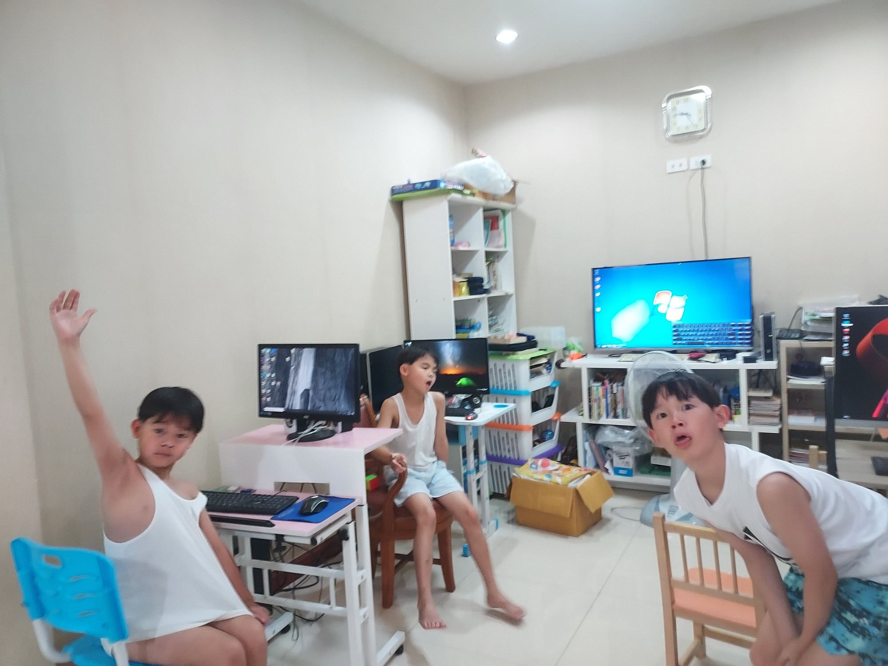

# 🚀 Guer's Roblox Journey 2026 test1

> "Small steps every day lead to big achievements tomorrow." Welcome to my personal coding space where I track my learning milestones in Roblox Studio and Lua scripting.

---

## 👨‍💻 Creator Profile (ข้อมูลผู้สร้างสรรค์)

- **Developer:** เด็กชาย ปณชัย สกุลเรืองรักษ์ / น้องเกื้อ (Panachai Sakulruangrak)
    
- **Role:** Junior Game Developer & Lua Scripter
    
- **Lead Mentor:** Sakchai Sakulraungrak / Dad (System Architect)
    
- **Project Base:** Sons-Logbook\Github-Guer\roblox-studio-portfolio
    

---

## 📸 The Origin: Day One (จุดเริ่มต้นการเดินทาง)

_นี่คือภาพถ่ายวันแรกที่ผมก้าวเข้าสู่โลกของการเขียนโปรแกรมคอมพิวเตอร์อย่างจริงจังร่วมกับครอบครัว_

  
  
<i>The Beginning of Greatness - Day 1 of Sean's Coding Odyssey (2026)</i>

---

## 🏆 Certificates & Achievements (ตู้โชว์ความสำเร็จ)

_รวบรวมเหรียญรางวัล ประกาศนียบัตร และผลงานชิ้นโบว์แดงของน้องเกอร์_

## _(ในอนาคตเมื่อน้องสร้างแมปสำเร็จ หรือได้การ์ดรางวัลจากคุณพ่อ นำภาพมาแปะเพิ่มในเซกชันนี้ได้เลยครับ)_

## 🗺️ Learning Roadmap (แผนที่นำทางสู่มืออาชีพ)

โครงสร้างการเรียนรู้ถูกวางระบบไว้ 5 เฟส เพื่อการเติบโตอย่างมั่นคง:

- [x] **Phase 1: Foundations** - การติดตั้งเครื่องมือ, ทำความเข้าใจ Workspace และการเขียนสคริปต์พื้นฐาน (Current)
    
- [ ] **Phase 2: Game Mechanics** - การสร้างระบบโต้ตอบ, การใช้เงื่อนไข Event และ GUI
    
- [ ] **Phase 3: Advanced Scripting** - การทำระบบเซฟข้อมูล (DataStore), Tables และ Module Scripts
    
- [ ] **Phase 4: Game Optimization** - การจัดระเบียบโครงสร้างโค้ด และการแก้บั๊กอย่างเป็นระบบ
    
- [ ] **Phase 5: World Launch** - การพัฒนาเกมของตัวเองจนจบและเผยแพร่สู่สาธารณะบน Roblox
    

---

## 📖 Logbook Index (สารบัญบันทึกการเรียนรู้)

_บันทึกรายสัปดาห์และรายวันฉบับละเอียด คุณพ่อสามารถพิมพ์เพิ่มแถวใหม่ต่อท้ายได้เรื่อย ๆ เมื่อเรียนจบในแต่ละครั้งครับ_

|**ครั้งที่ (Week)**|**วันที่/ช่วงเวลา**|**หัวข้อเนื้อหาที่เรียน (Topic)**|**ลิงก์อ่านบันทึกฉบับเต็ม**|
|---|---|---|---|
|**Week 1**|26/03/05|**Roblox Studio Setup** (เริ่มต้นติดตั้งโปรแกรมและลองลากชิ้นส่วนใน Workspace)|[อ่านบันทึก 2603w1](./1-execution-timeline/year-2026/guer202603.md)|
|**Week 2**|26/03/12|**Properties & Variables** (เรียนรู้คุณสมบัติของ Part และการฝากค่าลงตัวแปร)|[อ่านบันทึก 2603w2](https://www.google.com/search?q=logbook/2603w2-variables.md)|
|**Week 3**|26/03/19|**Do-While Logic Loop** (ฝึกการใช้ลูปทำงานซ้ำแบบมีเงื่อนไข)|[อ่านบันทึก 2603w3](https://www.google.com/search?q=logbook/2603w3-loops.md)|

---

© 2026 Guer's Coding Journey. Supervised by Dad. Managed with GitHub.